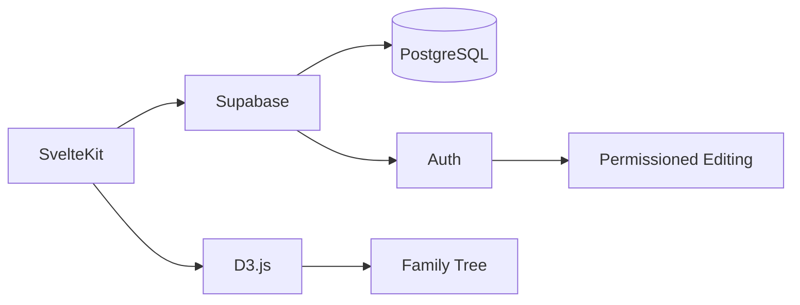
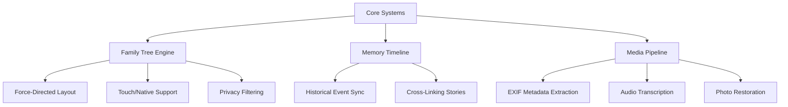

# 🌳 The LivingTree

**A living, growing family history archive**  
*Preserving your family's stories for generations to come*

[](LICENSE)
[](CONTRIBUTING.md)

## Table of Contents
- [✨ Project Vision](#-project-vision)
- [🌱 Contributing to The LivingTree](#-contributing-to-the-livingtree)
- [🧩 Tech Stack](#-tech-stack)
- [🏗️ Contribution Workflow (Proposed)](contribution-workflow-(proposed))
- [🔍 Code Exploration Areas](#-code-exploration-areas)
- [📜 License](#-license)
- [💬 Contact](#-contact)

## ✨ Project Vision

The LivingTree is an open-source initiative to create a dynamic family history archive that:
- Goes beyond static records to capture living memories
- Encourages collaboration across generations
- Preserves stories in multiple formats (text, audio, video)
- Respects privacy while celebrating shared heritage

## 🌱 Contributing to The LivingTree

*"Families grow branch by branch, and so does this project."*

### 🍃 How to Help (Even Without Code)

### 1. Improve Documentation
- Fix typos in our guides
- Translate materials to other languages

### 2. Spread the Word
- Star ⭐ this repository
- Share project goals with genealogy communities
- Document your testing process (blog/video)

### 💻 For Technical Contributors

### 1. Fork the Repository
1. Click **Fork** at top-right of [the-livingtree repo](https://github.com/yourusername/the-livingtree)
2. Clone **your fork**:
    ```bash
    # Remember to replace yourusername with your github username
    git clone https://github.com/yourusername/the-livingtree.git && cd the-livingtree
    ```
3. Create a Feature Branch
    ```bash
    # feature/your-feature-name
    git checkout -b feature/your-feature-name # or fix/your-fix-name
    ```
4. Push to your fork
    ```bash
    # Commit your code with a descriptive commit message before pushing
    git push origin feat/your-feature-name
    ```
5. Open a Pull Request (PR)

### 2. Initiate PR from Your Fork**
1. Go to: `https://github.com/yourusername/the-livingtree/pull/new/your-branch-name`
2. Click **"Compare across forks"**
3. Set base repo: `originalusername/the-livingtree` → `main`  
   Set head repo: `yourusername/the-livingtree` → `your-branch-name`

### 3. Use This PR Template**
```markdown
## Description
**What problem does this solve?**  
[Explain the context and motivation]

**Changes proposed**  
- Added relation type coloring
- Updated D3 force simulation
- Modified Supabase query

### Verification Steps
1. Checkout this branch: `git checkout your-branch-name`
2. Test family expansion: `pnpm test:relations`
3. Verify on mobile: `pnpm run dev -- --mobile`

### Screenshots/Recordings
| Desktop | Mobile |
|---------|--------|
|  |  |

### Related Issues
Closes #123  
Blocks #456
```
### 4. PR Best Practices

- ✅ **Keep small**  
  (1 feature/bug per PR)

- ✅ **Reference issues** using keywords:  
  `Closes #123` or `Relates to #456`

- ✅ **Request reviews** from:  
  `@originalusername/tech-leads`

- ✅ **Update CHANGELOG.md** if applicable

### 4. After Submission

**Address review comments** with new commits:
```bash
git commit -m "fix: address color contrast feedback"
git push origin your-branch-name
```


## 🧩 Tech Stack

### 🌿 Open Core
| Component       | Selected Technology | Why We Chose It                          | Help Needed |
|-----------------|---------------------|------------------------------------------|-------------|
| **Frontend**    | SvelteKit           | Fast, lightweight, and intuitive for contributors | UI animations, accessibility |
| **Visualization** | D3.js            | Gold standard for dynamic family trees   | Force-directed layouts |
| **Backend**     | Supabase            | Open-source Firebase alternative with PostgreSQL | RLS policies, extensions |
| **Auth**        | Supabase Auth       | Built-in with social logins              | OAuth providers |
| **Realtime**    | Supabase Realtime   | Websockets for collaborative editing     | Presence system |

### 📦 Supporting Stack



## 🏗️ Contribution Workflow (Proposed)

### 1. Claim a Draft Issue  
Look for [`good first issue`](https://github.com/yourusername/the-livingtree/labels/good%20first%20issue) or [`help wanted`](https://github.com/yourusername/the-livingtree/labels/help%20wanted) labels

### 2. Set Up Prototyping Sandbox  
```bash
# For UI components (planned):
git checkout -b feature/your-component
mkdir src/components/ui/your-component
touch src/components/ui/your-component/YourComponent.stories.js
```

### 3. Submit Early Draft PRs

We encourage "Work in Progress" PRs labeled with:

- `🚧 WIP` - For early feedback
- `💡 Proposal` - Architectural ideas  
- `🛠️ Spike` - Experimental branches

**Example PR titles:**
🚧 WIP: Initial family tree visualization component
💡 Proposal: Alternative database schema design
🛠️ Spike: Testing D3.js vs Cytoscape.js performance


**What to include:**
1. Clear description of your approach
2. Screenshots for UI changes
3. Known limitations/tradeoffs
4. Questions for reviewers

> 💡 Tip: Prefix your PR title with the appropriate emoji for faster triaging.

## Contributor Agreement

By participating, you agree to:

1. **Code Licensing**  
   - License all code contributions under MIT

2. **Content Rights**  
   - Confirm you have rights to share any submitted family content

3. **Archival Grant**  
   - Allow the project to maintain archival copies of contributed materials
  

## 🔍 Code Exploration Areas



## 📜 License

### Codebase License
```text
MIT License

Copyright (c) [2025] [Daniel Kosgei/The LivingTree Contributors]

Permission is hereby granted... [standard MIT terms]
```

### Family Content License
```text
Creative Commons Attribution-NonCommercial 4.0 (CC-BY-NC)
```

#### Content Rules

- 👪 **Contributor Ownership**  
  Contributors retain full copyright of their family materials

- 📚 **Archive Policy**  
  The project may preserve submitted materials indefinitely for historical purposes

- 🔒 **Privacy Protection**  
  Private family data will never be shared publicly without explicit consent

## 💬 Contact

### 📧 General Inquiries
**Email**: [hello@livingtree.org](mailto:hello@the-livingtree.com)  
*Response time: 2 business days*

### 🐛 Technical Support
**GitHub Issues**: [Report bugs](https://github.com/danielkosgei/the-livingtree/issues)  
**Discord**: [Join our tech chat](https://discord.gg/your-invite-link)

### 🌐 Community Spaces
- [Twitter/X](https://twitter.com/LivingTreeProj)  
- [Facebook Group](https://facebook.com/groups/livingtree)  
- [Genealogy Forum](https://forum.the-livingtree.com)

